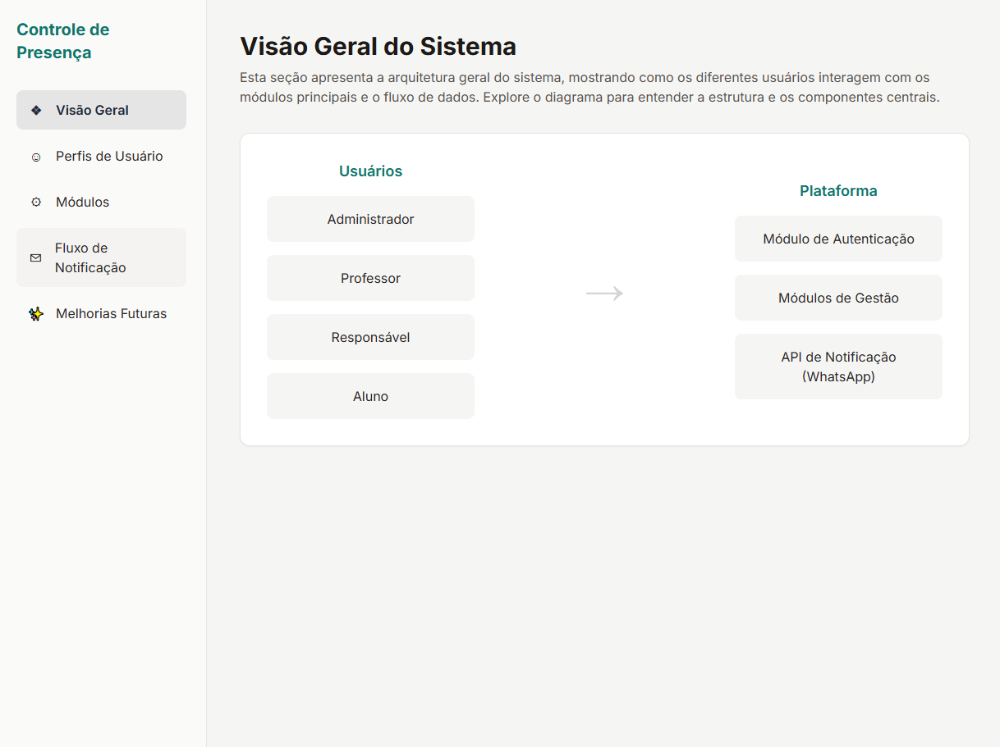

# Sistema de Controle de Presença - Visão Interativa

Este repositório apresenta o **fluxo visual e interativo** do sistema **IF Presence** (disponível em outro repositório).  
O objetivo é oferecer uma visão clara e dinâmica da estrutura do sistema, seus módulos, perfis de usuários e processos internos — facilitando a compreensão de como a aplicação funciona.

---

## Demonstração Visual

> *(Insira aqui a captura de tela ou diagrama do sistema)*

---

## Acesse o Sistema

🔗 **[Clique aqui para acessar a versão online](https://visao-sistema-controle-presenca.netlify.app/)**

---

## Sobre o IF Presence

O **IF Presence** é um sistema de controle de presença acadêmica que:
- Registra chamadas feitas por professores.
- Identifica automaticamente ausências.
- Notifica responsáveis via WhatsApp.
- Disponibiliza relatórios e funcionalidades para diferentes perfis de usuários.

Este repositório não contém a lógica de backend, apenas a **interface e o fluxo interativo**.

---
